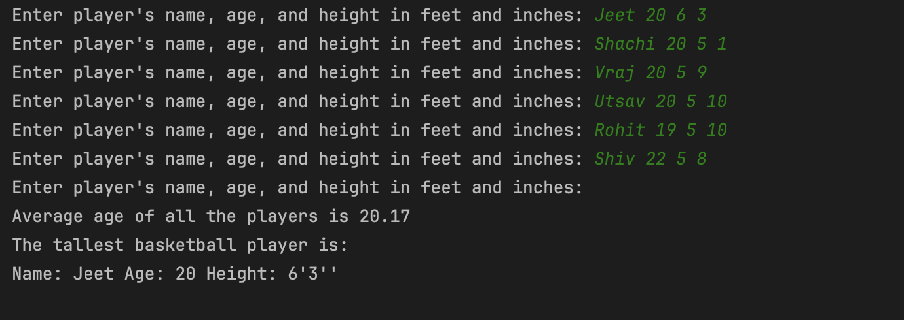

## Tallest Basketball Player
**Author - Jeet Soni**

**Date - March 1, 2025**

---

### :memo: Description

Wanna know if you the tallest player among your friends? Well, this program will help you with that!
I built this simple program using java-OOPS :grimacing: that tells you who the tallest player is.

### :thinking: How does it work?

Well, two classes and one main method does the magic!

`Height` Class:
* Takes feet and inches as input to represent a player's height. The constructor implements height normalization 
by converting the height into a standard format.
* Method `to_inches` converts height to inches and `to_string` method to pretty print the output. 

`Player` Class:
* Takes name, age and height of the player. I initialized `Height` class in the `Player` class constructor.
* Created a `getHeight` method that returns `Height` class `to_string` method.
* Created a `to_string` method provides a readable representation of the player’s details.

`Main` Class:
* Continuously asks user to enter player's name, age, feet and inches until they entered empty line.
* Calculates average age of all the players 
* Identifies and return tallest basketball player whose age is less than the average age.

:brain: What did I learn?

Well, I learned that this OOPS is better and important than when you make a mistake and say "OOPS":laughing:. 
This project helped me understand the importance of encapsulation, composition, and how object-oriented design 
makes the program modular and reusable.

Made with :heart: by Jeet Soni